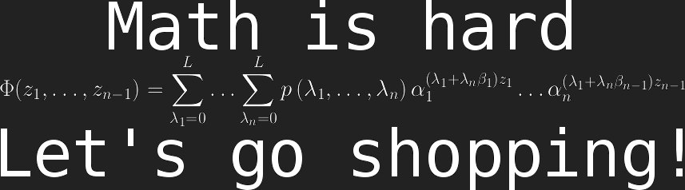

<!--  -->

I'm a researcher working at the intersection of data science and high performance computing.  I'm currently a graduate student, but I'm very interested in a full time data science or developer gig. You can [find my CV here](files/DrewSchmidtResume.pdf).

I spend a lot of time thinking about dimension reduction, machine learning, distributed systems, and text mining. I also have a very strong interest in profiling and performance analysis. My research generally involves a lot of C and Fortran with an R interface sprinkled on top.

* See my [code](code.html)
* See my [presentations](presentations.html)
* See my [publications](publications.html)

 
Site template is [jekyll-clean-dark](https://github.com/streetturtle/jekyll-clean-dark).
